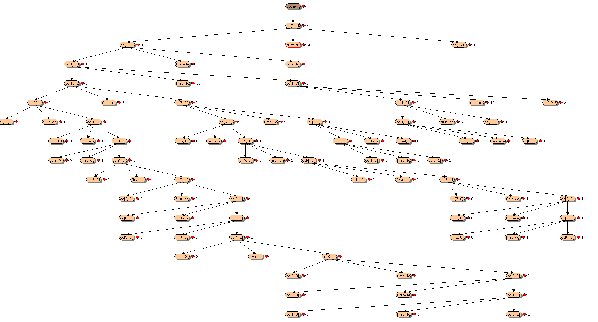

1.2.3 Order of Growth

In computers that do only a fixed number of operations at a time, the time required will be proportional to the number of elementary machine operations performed. We say that R(n) has order of growth $\theta(f(n))$ , written $R(n) = \theta(f(n))$  (pronounced "theta of f(n)''), if there are positive constants k1 and k2 independent of n such that for any sufficiently large value of n. (In other words, for large n, the value R(n) is sandwiched between k1f(n) and k2f(n).)
$$
kf(n) \le R(n) \le k_2f(n)
$$

- process grows as $\theta(n)$.
- the space required grows as $\theta(n)$.

The tree-recursive Fibonacci computation requires $\theta(\phi^n)$ steps and space $\theta(n)$, where is the golden ratio.

Orders of growth provide only a crude description of the behavior of a process. For example, a process requiring $n^2$ steps and a process requiring $1000n^2$ steps and a process requiring $3n^2 + 10n + 17$ steps all have $\theta(n^2)$ order of growth.

For an exponential process, each increment in problem size will multiply the resource utilization by a constant factor.


- n 为计算机需要处理的问题数量，R(n) 为处理问题所需要的计算资源——可以是内存或机器指令
- 计算过程所需要的步骤，计算过程所需要的计算资源（内存 storage registers、机器指令 elementary machine operations）
- 线性递归需要的步骤是线性增长 $\theta(n)$，需要的计算资源也是线性增长 $\theta(n)$ 
- 线性迭代需要的步骤是线性增长 $\theta(n)$，需要的计算资源是固定数值 $\theta(1)$
- 树形递归的斐波那契数列，需要的步骤是 $\theta(\phi^n)$ ，需要的计算资源是 $\theta(n)$ 
- 计算步骤呈对数增长，需要的计算资源


练习 

1.14  绘制过程 count-change 换 11 cents 的树状图

```lisp
#lang racket
(define (count-change amount)
  (cc amount 5))

(define (cc amount kinds-of-coins)
  (cond ((= amount 0) 1)
        ((or (< amount 0) ( = kinds-of-coins 0)) 0)
        (else (+ (cc amount
                     (- kinds-of-coins 1))
                 (cc (- amount
                        (first-denomination kinds-of-coins))
                     kinds-of-coins)))))

(define (first-denomination kinds-of-coins)
  (cond ((= kinds-of-coins 1) 1)
        ((= kinds-of-coins 2) 5)
        ((= kinds-of-coins 3) 10)
        ((= kinds-of-coins 4) 25)
        ((= kinds-of-coins 5) 50)))

(require racket/trace)
(trace count-change)
(count-change 11)
```



这是一个树形递归，时间复杂度和控件复杂度分别为 $\theta(n)$ 

- 如看一个问题的计算步骤随着 n 的增长呈怎样的增长
- 如看一个问题的需要的计算资源随着 n 的增长呈怎样的增长


1.15

```lisp
(define  (cube x)
  (* x x x))

(define (p x)
  (- (* 3 x) (* 4 (cube x))))

(define (sine angle)
  (if (not (> (abs angle) 0.1))
      angle
      (p (sine (/ angle 3.0)))))

(require racket/trace)
(trace p)
(sine 12.15)
```

a. 计算（sine 12.15）时过程 p 跑了多少次

```
(trace p) 看到 p 跑了 5 次

>(p 0.049999999999999996)
<0.1495
>(p 0.1495)
<0.4351345505
>(p 0.4351345505)
<0.9758465331678772
>(p 0.9758465331678772)
<-0.7895631144708228
>(p -0.7895631144708228)
<-0.39980345741334
-0.39980345741334
```


b. sine 的时间复杂度和控件复杂度的 order of growth 分别是多少 

(sine n)，n 每乘以 3 一次，p 就多跑一次，所以 sine 的时间复杂度为 $\theta(log_3n)$


> [Order of Growth](http://www.ccs.neu.edu/home/jaa/CS7800.12F/Information/Handouts/order.html)

