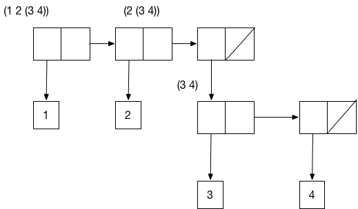
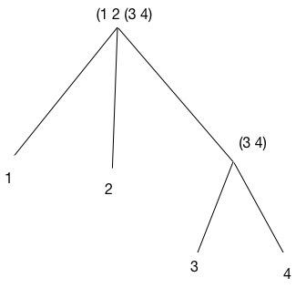

### 2.2.2 Hierarchical Structures 层次性结构


使用 list 来表示 sequence，很自然地其元素本身也可以是 sequence。如，由 

`(cons (list 1 2) (list 3 4))` 

得到

 `((1 2) 3 4)`


```lisp
(define (count-leaves x)
  (cond ((null? x) 0)
        ((not (pair? x)) 1)
        (else (+ (count-leaves (car x))
                 (count-leaves (cdr x))))))
```


### 练习

2.24

```lisp
(list 1 (list 2 (list 3 4)))
; '(1 (2 (3 4)))
```






2.25

```lisp
; ( 1 3 (5 7) 9)
(define one (list 1 3 (list 5 7) 9))
one
(car (cdr (car (cdr (cdr one)))))
(newline)

; ((7))
(define two (list (list 7)))
two
(car (car two))
(newline)

; (1 (2 (3 (4 (5 (6 7))))
(define three (list 1 (list 2 (list 3 (list 4 (list 5 (list 6 7)))))))
three
(car (cdr (car (cdr (car (cdr (car (cdr (car (cdr (car (cdr three))))))))))))

; '(1 3 (5 7) 9)
; 7

; '((7))
; 7

; '(1 (2 (3 (4 (5 (6 7))))))
; 7 
```


2.26

```lisp
(define x (list 1 2 3))

(define y (list 4 5 6))

(append x y)

(cons x y)

(list x y)

; '(1 2 3 4 5 6)
; '((1 2 3) 4 5 6)
; '((1 2 3) (4 5 6))
```


2.27 

```lisp
(define (reverse lst)
  (define (reverse-iter lst-iter result)
    (if (null? lst-iter)
        result
        (reverse-iter (cdr lst-iter) (cons (car lst-iter) result))))
  (reverse-iter lst null))

(define (deep-reverse lst)
  (define (deep-reverse-iter lst-iter result)
    (if (null? lst-iter)
        result
        (deep-reverse-iter
         (cdr lst-iter)
         (cons (if (pair? (car lst-iter))
                   (deep-reverse (car lst-iter))
                   (car lst-iter))
               result))))
  (deep-reverse-iter lst null))

(define x (list (list 1 2) (list 3 4)))

x

(reverse x)

(deep-reverse x)

; '((1 2) (3 4))
; '((3 4) (1 2))
; '((4 3) (2 1))
```


2.28

```lisp
(define (fringe tree)
  (cond ((null? tree) null)
        ((pair? tree) (append (fringe (car tree))
                              (fringe (cdr tree))))
        (else (list tree))))          
            
(define x (list (list 1 2) (list 3 4)))

x

(fringe x)
```


2.29

```lisp
(define (make-mobile left right)
  (list left right))

(define (make-branch length structure)
  (list length structure))

```


a.

```lisp
(define (left-branch mobile)
  (car mobile))

(define (right-branch mobile)
  (cdr mobile))

(define (branch-length branch)
  (car branch))

(define (branch-structure branch)
  (cdr branch))

```


b.

```lisp
(define (total-weight mobile)
  (cond ((null? mobile) 0)
        ((pair? mobile) (+ (total-weight (car (branch-structure (left-branch mobile))))
                           (total-weight (car (branch-structure (right-branch mobile))))))
        (else mobile)))
```


c.

```lisp
(define (balance? mobile)
  (let ((left  (left-branch mobile))
        (right (right-branch mobile))
        (left-structure (branch-structure (left-branch mobile)))
        (right-structure (branch-structure (right-branch mobile))))
    (if (pair? left-structure)
        (if (pair? right-structure)
            (and (balance? left-structure) (balance? right-structure))
            (if (balance? left-structure)
                (= (* (branch-length left) (total-weight left-structure))
                   (* (branch-length right) right-structure))
                false))
        (if (pair? right-structure)
            (if (balance? right-structure)
                (= (* (branch-length left) left-structure)
                   (* (branch-length right) (total-weight right-structure)))
                false)
            (= (* (branch-length left) left-structure)
               (* (branch-length right) right-structure))))))
; 需要简化，提高可读性
```


d.

```lisp
; 修改 mobile 的表示形式 -- list 改为 cons
(define (make-mobile left right)
  (cons left right))

(define (make-branch length structure)
  (cons length structure))

; 只需要改 right-branch 和 branch-structure 的取值方式 

(define (right-branch mobile)
  (car (cdr mobile)))

; 改为
(define (right-branch mobile)
  (car mobile))

(define (branch-structure branch)
  (car (cdr branch)))

; 改为
(define (branch-structure branch)
  (car branch))
```


#### Mapping over trees

map 和递归结合是处理树的有效工具。

2.2.2 节中的 scale-list，可以有 scale-tree，如，使用递归：

```lisp
(define (scale-tree tree factor)
  (cond ((null? tree) null)
        ((not (pair? tree)) (* tree factor)) 
        (else (cons (scale-tree (car tree) factor)
                    (scale-tree (cdr tree) factor)))))

(scale-tree (list 1 (list 2 (list 3 4) 5) (list 6 7))
            10)

```

将 tree 看做是 sub-tree 的 sequence，则可以使用 map 来处理 sequence：

```lisp
(define (scale-tree-map tree factor)
  (map (lambda (sub-tree)
         (if (pair? sub-tree)
             (scale-tree sub-tree factor)
             (* sub-tree factor)))
       tree))
```


2.30

```lisp
(define (square-tree tree)
  (map (lambda (sub-tree)
         (if (pair? sub-tree)
             (square-tree sub-tree)
             (* sub-tree sub-tree)))
       tree))

(square-tree (list 1
              (list 2 (list 3 4) 5)
              (list 6 7)))
```


2.31

```lisp
(define (square x)
  (* x x))

(define (tree-map proc tree)
    (map (lambda (sub-tree)
         (if (pair? sub-tree)
             (square-tree sub-tree)
             (proc sub-tree)))
       tree))

(define (square-tree tree)
  (tree-map square tree))

(square-tree (list 1
              (list 2 (list 3 4) 5)
              (list 6 7)))
```


2.32 **set** — a list of distinct elements. Represent the set of all subsets of the set as a list of lists.

For example, if the set is (1 2 3), then the set of all subsets is (() (3) (2) (2 3) (1) (1 3) (1 2) (1 2 3)).

```lisp
(define (subsets s)
  (if (null? s)
      (list null)
      (let ((rest (subsets (cdr s))))
        (append rest (map (lambda (x) (append (list (car s)) x))
                          rest)))))

(subsets (list 1 2 3))
```


