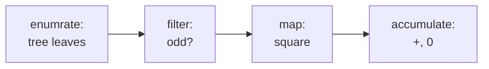

### 2.2.3 Sequences as Conventional Interfaces


*Outline* 

[TOC]


这一节，介绍另一个处理数据结构的设计原则—— the use of **conventional interfaces**.

类似在 1.3 节中使用 higher-order procedure 抽象出通用模式来处理 numerical data，我们 formulate 类似的 operations 来处理 compound data，依赖于我们处理数据结构的方式。

如 count-leaves

```lisp
(define (sum-odd-squares tree)
  (cond ((null？ tree) 0)
    ((not (pair? tree))
     (if (odd? tree) (square tree) 0))
    (else (+ (sum-odd-squares (car tree))
             (sum-odd-squares (cdr tree))))))
    
```

如 even-fibs

```lisp
(define (even-fibs n)
  (define (next k)
    (if (> k n)
        null
        (let ((f (fib k)))
             (if (even? f)
                 (cons f (next (+ k 1)))
                 (next (+ k 1))))))
  (next 0))
```

这两个 procedure 的执行过程:

count-leaves

- 「生成」树的叶子节点
- 「过滤」他们，获取其中的奇数
- 「平方」得到的奇数
- 使用 + 来 「accumulates」 平方的结果，从 0 开始



even-fibs

- 「生成」从 0 到 n 的整数
- 「计算」每个整数的 Fibonacci 数
- 「过滤」他们，获取其中的偶数
- 使用 cons 来 「accumulate」 得到的偶数，从一个空 list 开始


如同 [Signal-flow](https://www.wikiwand.com/en/Signal-flow_graph) 


#### Sequence Operations

要恰当地组织 programs 来表达 signal-flow 结构，关键在于以每个步骤之间的 「signal」为核心。

**以 lists 来表示 signals**，使用 list operations 实现每个步骤的 processing。

如

```lisp
(map square (list 1 2 3 4 5))
; ( 1 4 9 16 25)
```


Filtering

```lisp
(define (filter predicate sequence)
  (cond ((null? sequence) null)
    ((predicate (car sequence))
     (cons (car sequence)
           (filter predicate (cdr sequence))))
    (else (filter predicate (cdr sequence)))))

(filter odd? (list 1 2 3 4 5))
; (1 3 5)
```


Accumulate

```lisp
(define (accumulate op initial sequence)
  (if (null? sequence)
      initial
      (op (car sequence)
          (accumulate op initial (cdr sequence)))))

(accumulate + 0 (list 1 2 3  4 5))
; 15

(accumulate * 1 (list 1 2 3  4 5))
; 120

(accumulate cons null (list 1 2 3 4 5))
; (1 2 3 4 5)

```


对于 even-fibs 

```lisp
(define (enumerate-interval low high)
  (if (> low high)
      null
      (cons low (enumerate-interval (+ low 1) high))))

(enumerate-interval 2 7)
; (2 3 4 5 6 7)
```


对于 tree

```lisp
(define (enumerate-tree tree)
  (cond ((null? tree) null)
    ((not (pair? tree)) (list tree))
    (else (append (enumerate-tree (car tree))
                  (enumerate-tree (cdr tree))))))

(enumerate-tree (list 1 (list 2 (list 3 4)) 5))
; (1 2 3 4 5)
```


reformulate sum-odd-squares

```lisp
(define (sum-odd-squares tree)
  (accumulate + 
              0
              (map square
                   (filter odd?
                           (enumerate-tree tree)))))

```


reformulate even-fibs

```lisp
(define (even-fibs n)
  (accumulate cons
              null
              (filter even? (map fib 
                                 (enumerate-interval 0 n)))))

```


在工程设计中 Modular construction 是控制复杂性的有效策略，如，使用 sum-odd-squares 和 even-fibs 中的片段来构造新的 procedure

```lisp
(define (list-fib-squares n)
  (accumulate cons
             null
             (map square 
                  (map fib
                       (enumerate-interval 0 n)))))
(list-fib-squares 10)

; (0 1 1 4 9 25 64 169 441 1156 3025)
```


```lisp
(define (product-of-squares-of-odd-elements sequences)
  (accumulate * 
              1
              (map square
                   (filter odd? sequences))))

(product-of-squares-of-odd-elements (list 1 2 3 4 5))

; 225
```


```lisp
(define (salary-of-highest-paid-programmer records)
  (accumulate max
              0
              (map salary
                   (filter programmer? records))))
```


Additionally, when we uniformly represent structures as sequences, we have  localized the datastructure dependencies in our programs to a small number of sequence operations. 


#### 练习

2.33 

```lisp
(define (accumulate op initial sequence)
  (if (null? sequence)
      initial
      (op (car sequence)
          (accumulate op initial (cdr sequence)))))

(define (map p sequence)
  (accumulate (lambda (x y) (cons (p x) y)) null sequence))

(define (square x)
  (* x x))

(map square (list 1 2 3 4 5))

(define (append seq1 seq2)
  (accumulate cons seq2 seq1))

(append (list 1 2 3) (list 4 5 6 7))

(define (length sequence)
  (accumulate (lambda (x y) (+ y 1))
              0
              sequence))

(length (list 1 2 3 4 5 6))
```


2.34

```lisp
(define (accumulate op initial sequence)
  (if (null? sequence)
      initial
      (op (car sequence)
          (accumulate op initial (cdr sequence)))))

(define coefficient (list 1 3 0 5 0 1))

(define (horner-eval x coefficient-sequence)
        (accumulate (lambda (this-coeff higher-term) (+ this-coeff (* x higher-term)))
                    0
                    coefficient-sequence))

(horner-eval 2 coefficient)
; 79
```


2.35

```lisp
(define (accumulate op initial sequence)
  (if (null? sequence)
      initial
      (op (car sequence)
          (accumulate op initial (cdr sequence)))))

(define (count-leaves t)
  (accumulate +
              0
              (map (lambda (x)
                     (if (pair? x)
                         (count-leaves x)
                         1))
                         
                   t)))

(define x (cons (list 1 2) (list 3 4)))

(count-leaves x)
```


2.36

```lisp
(define (accumulate op initial sequence)
  (if (null? sequence)
      initial
      (op (car sequence)
          (accumulate op initial (cdr sequence)))))

(define (accumulate-n op init seqs)
  (if (null? (car seqs))
      null
      (cons (accumulate op
                        init
                        (accumulate cons null (map (lambda (x) (car x)) seqs)))
            (accumulate-n op
                          init
                          (accumulate cons null (map (lambda (x) (cdr x)) seqs))))))

(define test (list (list 1 2 3) (list 4 5 6) (list 7 8 9) (list 10 11 12)))

(accumulate-n + 0 test)
```


2.37

`(dot-product v w)`，return the sum $\sum_i w_i v_i$ 

`(matrix-*-vector m v)`，return the vector t，where $t_i$ = $\sum_j m_{ij} v_j$ 

`(matrix-*-matrix m n)`，return the matrix p， where $p_{ij} = \sum m_{ik} n_{kj}$

`(transpose m)`， return the matrix n，where $n_{ij} = m_{ji}$

[Matrix](https://www.wikiwand.com/en/Matrix_(mathematics))

```lisp
(define (accumulate op initial sequence)
  (if (null? sequence)
      initial
      (op (car sequence)
          (accumulate op initial (cdr sequence)))))

(define (accumulate-n op init seqs)
  (if (null? (car seqs))
      null
      (cons (accumulate op
                        init
                        (accumulate cons null (map (lambda (x) (car x)) seqs)))
            (accumulate-n op
                          init
                          (accumulate cons null (map (lambda (x) (cdr x)) seqs))))))

(define matrix-test (list (list 1 2 3 4) (list 4 5 6 6) (list 6 7 8 9) (list 6 7 8 9)))
(define vector-test (list 1 2 3 4))
(define w (list 1 2 3 4))

(define (dot-product v w)
  (accumulate + 0 (map * v w)))

(dot-product vector-test w)

(define (matrix-*-vector m v)
  (map (lambda (items)
         (dot-product items v)) m))

(matrix-*-vector matrix-test vector-test)

(define (transpose mat)
  (accumulate-n cons null mat))

(transpose matrix-test)

(define (matrix-*-matrix m n)
  (let ((cols (transpose n)))
    (map (lambda (items)
           (matrix-*-vector cols items)) m)))

(matrix-*-matrix matrix-test matrix-test)

```


3.38

```lisp
(define (accumulate op initial sequence)
  (if (null? sequence)
      initial
      (op (car sequence)
          (accumulate op initial (cdr sequence)))))

(define fold-right accumulate)

(define (fold-left op initial sequence)
  (define (iter result rest)
    (if (null? rest)
        result
        (iter (op result (car rest))
              (cdr rest))))
  (iter initial sequence))

(fold-right / 1 (list 1 2 3))
(fold-left / 1 (list 1 2 3))
; 1+1/2
; 1/6

(fold-right list null (list 1 2 3))
(fold-left list null (list 1 2 3))
; '(1 (2 (3 ())))
; '(((() 1) 2) 3)

(fold-right + 0 (list 1 2 3))
(fold-left + 0 (list 1 2 3))
; 6
; 6
```


2.39

```lisp
(define (accumulate op initial sequence)
  (if (null? sequence)
      initial
      (op (car sequence)
          (accumulate op initial (cdr sequence)))))

(define fold-right accumulate)

(define (fold-left op initial sequence)
  (define (iter result rest)
    (if (null? rest)
        result
        (iter (op result (car rest))
              (cdr rest))))
  (iter initial sequence))


(define (reverse sequence)
  (fold-right (lambda (x y)
                (append y (list x))) null  sequence))

(reverse (list 1 2 3))

(define (reverse-left sequence)
  (fold-left (lambda (x y) (cons y x)) `() sequence))

(reverse-left (list 1 2 3))
```


#### Nested Mappings

```lisp
(accumulate append 
            null
            (map (lambda (i)
                         (map (lambda (j) (list i j))
                              (enumerate-interval 1 (- i 1))))
                 (enumerate-interval 1 n)))

(define (flatmap proc seq)
  (accumulate append null (map proc seq)))

(define (prime-sum? pair)
  (prime? (+ (car pair) (cadr pair))))

(define (make-pair-sum pair)
  (list (car pair) (cadr pair) (+ (car pair) (cadr pair))))

(define (prime-sum-pairs n)
  (map make-pair-sum
       (filter prime-sum?
               (flatmap (lambda (i)
                                (map (lambda (j) (list i j))
                                     (enumerate-interval 1 (- i 1))))
                        (enumerate-interval 1 n)))))

(define (permutations s)
  (if (null? s)
      (list null)
      (flatmap (lambda (x) (map (lambda (p) (cons x p))
                                (permutations (remove x s))))
               s)))

(define (remove item sequence)
  (filter (lambda (x) (not (= x item)))
          sequence))

```


2.40

```lisp
(define (accumulate op initial sequence)
  (if (null? sequence)
      initial
      (op (car sequence)
          (accumulate op initial (cdr sequence)))))

(define (flatmap proc seq)
  (accumulate append null (map proc seq)))

(define (enumerate-interval low high)
  (if (> low high)
      null
      (cons low (enumerate-interval (+ low 1) high))))
;
(define (unique-pair n)
  (flatmap (lambda (i)
             (map (lambda (j) (list i j))
                  (enumerate-interval 1 (- i 1))))
           (enumerate-interval 1 n)))

(define (make-pair-sum pair)
  (list (car pair) (cadr pair) (+ (car pair) (cadr pair))))

; -------- prime? ---------
(define (square n)
  (* n n))

(define (smallest-divisor n)
  (find-divisor n 2))

(define (find-divisor n test-divisor)
  (cond ((= (square test-divisor) n) n)
        ((divides? test-divisor n) test-divisor)
        (else (find-divisor n (+ test-divisor 1)))))

(define (divides? a b)
  (= (remainder b a) 0))

(define (prime? n)
  (= (smallest-divisor n) n))
; --------- prime? ----------

(define (prime-sum? pair)
  (prime? (+ (car pair) (cadr pair))))

(define (prime-sum-pairs n)
  (map make-pair-sum
       (filter prime-sum? (unique-pair n))))
```


2.41

```lisp
(define (accumulate op initial sequence)
  (if (null? sequence)
      initial
      (op (car sequence)
          (accumulate op initial (cdr sequence)))))

(define (filter predicate sequence)
  (cond ((null? sequence) null)
    ((predicate (car sequence))
     (cons (car sequence)
           (filter predicate (cdr sequence))))
    (else (filter predicate (cdr sequence)))))

(define (enumerate-interval low high)
  (if (> low high)
      null
      (cons low (enumerate-interval (+ low 1) high))))

(define (flatmap proc seq)
  (accumulate append null (map proc seq)))

(define (unique-pairs n)
  (flatmap (lambda (i)
             (map (lambda (j) (list i j))
                  (enumerate-interval 1 (- i 1))))
           (enumerate-interval 1 n)))

(define (unique-triples n)
  (flatmap
   (lambda (i)
     (map (lambda (j) (cons i j)) (unique-pairs (- i 1))))
   (enumerate-interval 1 n)))

(define (sum-to-triple n s)
  (filter (lambda (triple)
            (= s (accumulate + 0 triple)))
          (unique-triples n)))

(sum-to-triple 10 6)
```


2.42 八皇后算法：假设我们已经生成了在 k-1 columns 放置 k-1 个 queens 的所有可能序列。对每一个序列有一个扩展集合，在第 k column 的每一行放置 queen。现在过滤这个扩展集合，得到相对于其他 queen 唯一的安全位置。这样就能得到在 k columns 放置 k 个 queens 的所有方式。使用这个处理方式，就能得到这个 puzzle 的所有解决方案。

- queen-cols，返回放置 k 列 queens 的所有方式

```lisp
(define (queens board-size)
  (define (queen-cols k)
    (if (= k 0)
        (list empty-board)
        (filter  
         (lambda (positions) (safe? k positions))
         (flatmap 
          (lambda (reset-of-queens)
                  (map (lambda (new-row)
                               (adjoin-position new-row k rest-of-queens))
                       (enumerate-interval 1 board-size)))
          (queen-cols (- k 1))))))
  (queen-cols board-size))

```

- new-row，表示 queen 放在第 k 列的哪个位置，  1 <=new-row <= k 
- adjoin-position，连接 row-column 和 rest-of-queens ` (cons new-row rest-of-queens)` ，得到一个可能序列
- empty-board，表示一个空位置  null
- safe?，确定一个位置是否安全，只需检查新的位置是否安全，其他位置已经确保安全。

```lisp
(define (enumerate-interval low high)
  (if (> low high)
      null
      (cons low (enumerate-interval (+ low 1) high))))

(define (accumulate op initial sequence)
  (if (null? sequence)
      initial
      (op (car sequence)
          (accumulate op initial (cdr sequence)))))

(define (flatmap proc seq)
  (accumulate append null (map proc seq)))

(define empty-board null)

(define (safe? k positions)
  (define (iter-sale kth-position rest-positions i)
    (if (null? rest-positions)
        true
        (if (or (= kth-position (car rest-positions))
                (= kth-position (- (car rest-positions) i))
                (= kth-position (+ (car rest-positions) i)))
            false
            (iter-sale kth-position (cdr rest-positions) (+ i 1)))))
  (iter-sale (car positions) (cdr positions) 1))
        
(define (adjoin-position new-row k rest-of-queens)
  (cons new-row rest-of-queens))

(define (queens board-size)
  (define (queen-cols k)
    (if (= k 0)
        (list empty-board)
        (filter  
         (lambda (positions) (safe? k positions))
         (flatmap 
          (lambda (rest-of-queens)
                  (map (lambda (new-row)
                               (adjoin-position new-row k rest-of-queens))
                       (enumerate-interval 1 board-size)))
          (queen-cols (- k 1))))))
  (queen-cols board-size))

(queens 8)

;'((4 2 7 3 6 8 5 1)
;  (5 2 4 7 3 8 6 1)
;  (3 5 2 8 6 4 7 1)
;  (3 6 4 2 8 5 7 1)
;  (5 7 1 3 8 6 4 2)
;  (4 6 8 3 1 7 5 2)
;  ......
;  (6 3 5 7 1 4 2 8)
;  (6 4 7 1 3 5 2 8)
;  (4 7 5 2 6 1 3 8)
;  (5 7 2 6 3 1 4 8))
;> 
```


2.43

```lisp
(define (queens board-size)
  (define (queen-cols k)
    (if (= k 0)
        (list empty-board)
        (filter  
         (lambda (positions) (safe? k positions))
         (flatmap
          (lambda (new-row)
            (map (lambda (rest-of-queens)
                   (adjoin-position new-row k rest-of-queens))
                 (queen-cols (- k 1))))
          (enumerate-interval 1 boad-size)))))
  (queen-cols board-size))
```

2.42 里面执行了 k 次 enumerate-interval，是一个线性迭代

Louis 的版本对每一个 enumerate-interval 产生的元素运行一次 queen-cols，直到 k = 1。如同一个 深度为 k，广度为 board-size 的树。

因此，如果 2.42 中的算法解决问题需要的时间是 T，则 Louis 的算法需要的时间是 $T^k$ 


