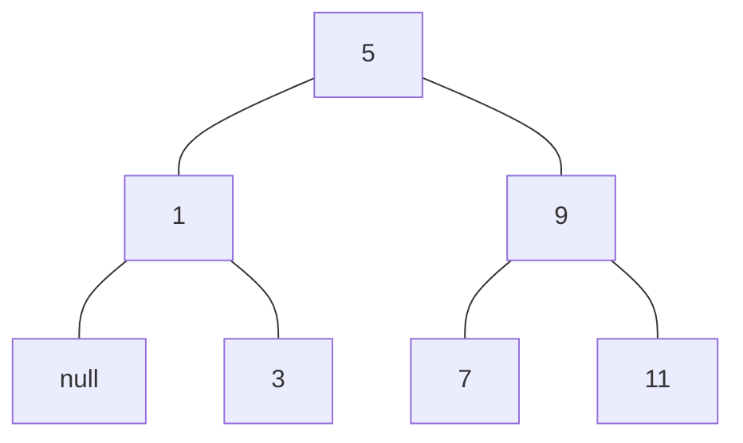

### 2.3.3 Example：Representing Sets


outline

[TOC]


- union-set 并集
- intersection-set 交集
- element-of-set?
- adjoin-set


#### Sets as unordered lists

- a list of its elements in which no element appears more than once.
- empty set is representde by the empty list.


```lisp
(define (element-of-set? x set)
  (cond ((null? set) false)
    ((equal? x (car set)) true)
    (else (element-of-set? x (cdr set)))))

(define (adjoin-set x set)
  (if (element-of-set? x set)
      set
      (cons x set)))

(define (intersection-set set1 set2)
  (cond ((or (null? set1) (null? set2)) '())
    ((element-of-set? (car set1) set2)
     (cons (car set1) 
           (intersection-set (cdr set1) set2)))
    (else (intersection-set (cdr set1) set2))))
```


##### Exercise 2.59

```lisp
(define (union-set set1 set2)
  (cond ((null? set1) set2)
    ((null? set2) set1)
    (else (if (element-of-set? (car set1) set2)
              (union-set (cdr set1) set2)
              (cons (car set1) (union-set (cdr set1) set2))))))

(define set-1 (list 1 2 3))
(define set-2 (list 3 4 5))

(union-set set-1 set-2)
; '(1 2 3 4 5)
```


##### Exercise 2.60

set allow duplicates. For instance, the set { 1, 2, 3 } could be represented as the list (2 3 2 1 3 2 2). 

```lisp
(define (element-of-set? x set)
  (cond ((null? set) false)
    ((equal? x (car set)) true)
    (else (element-of-set? x (cdr set)))))

(define (adjoin-set x set)
  (cons x set))

(define (intersection-set set1 set2)
  (cond ((or (null? set1) (null? set2)) '())
    ((element-of-set? (car set1) set2)
     (cons (car set1) 
           (intersection-set (cdr set1) set2)))
    (else (intersection-set (cdr set1) set2))))

(define (union-set set1 set2)
  (cond ((null? set1) set2)
    ((null? set2) set1)
    (else (cons (car set1) (union-set (cdr set1) set2)))))

(define set-1 (list 1 2 3))
(define set-2 (list 3 4 5))

(union-set set-1 set-2)
; '(1 2 3 3 4 5)
```


|                  | non-duplicate set | duplicate set |
| ---------------- | ----------------- | ------------- |
| element-of-set?  | $O(n)$            | $O(n)$        |
| adjoin-set       | $O(n)$            | $O(1)$        |
| intersection-set | $O(n^2)$          | $O(n^2)$      |
| union-set        | $O(n^2)$          | $O(n^2)$      |


对于需要频繁进行 adjoin-set 的 set，选择 duplicate set。

对于应用 element-of-set?、intersection-set、union-set 较多的 set，选择 non-duplicate set。


#### Sets as ordered lists

```lisp
(define (element-of-set? x set)
  (cond ((null? set) false)
    ((= x (car set)) true)
    ((< x (car set)) false)
    (else (element-of-set? x (cdr set)))))

(define (intersection-set set1 set2)
  (if (or (null? set1) (null? set2))
      '()
      (let ((x1 (car set1)) (x2 (car set2)))
           (cond 
             ((= x1 x2) (cons x1 (intersection-set (cdr set1) (cdr set2))))
             ((< x1 x2) (intersection-set (cdr set1) set2))
             ((< x2 x1) (intersection-set set1 (cdr set2)))))))
```


|                  | unordered set | ordered set |
| ---------------- | ------------- | ----------- |
| element-of-set?  | $O(n)$        | $O(n/2)$    |
| adjoin-set       | $O(n)$        | $O(n/2)$    |
| intersection-set | $O(n^2)$      | $O(n)$      |
| union-set        | $O(n^2)$      | $O(n)$      |


##### Exercise 2.61

```lisp
(define (adjoin-set x set)
  (cond ((null? set) (cons x set))
    ((= x (car set)) set)
    ((< x (car set)) (cons x set)))
    (else (cons (car set) (adjoin-set x (cdr set))))))
```


##### Exercise 2.62

```lisp
(define (union-set set1 set2)
  (cond ((null? set1) set2)
    ((null? set2) set1)
    (else (let ((x1 (car set1)) (x2 (car set2)))
            (cond
              ((= x1 x2) (union-set (cdr set1) set2))
              ((< x1 x2) (cons x1 (union-set (cdr set1) set2)))
              ((< x2 x1) (cons x2 (union-set set1 (cdr set2)))))))))
  
(define set-1 (list 1 2 3))
(define set-2 (list 3 4 5))

(union-set set-1 set-2)
; '(1 2 3 4 5)
```


#### Sets as binary trees

- Each node of the tree holds one element of the set, called the "entry" at that node, and a link to each of two other (passibly empty) nodes. 
- The "left" link points to elements smaller than the one at the node, and the "right" link to elements greater than the one at the node.


```lisp
(define (entry tree)
  (car tree))

(define (left-branch tree)
  (cadr tree))

(define (right-branch tree)
  (caddr tree))

(define (make-tree entry left right)
  (list entry left right))
```


```lisp
(define (element-of-set? x set)
  (cond ((null? set) false)
    ((= x (entry set)) true)
    ((< x (entry set)) (element-of-set? x (left-branch set)))
    ((> x (entry set)) (element-of-set? x (right-branch set)))))

(define (adjoin-set x set)
  (cond 
    ((null? set) (make-tree x '() '()))
    ((= x (entry set)) set)
    ((< x (entry set))
     (make-tree (entry set)
                (adjoin-set x (left-branch set))
                (right-branch set)))
    ((> x (entry set)
        (make-tree (entry set)
                   (left-branch set)
                   (adjoin-set x (right-branch set)))))))
```


|                 | ordered set as balanced tree | ordered set |
| --------------- | ---------------------------- | ----------- |
| element-of-set? | $O(\log n)$                  | $O(n/2)$    |
| adjoin-set      | $O(\log n)$                  | $O(n/2)$    |


##### Exercise 2.63

convert a binary tree to a list

```lisp
(define (tree->list-1 tree)
  (if (null? tree)
      '()
      (append (tree->list-1 (left-branch tree))
              (cons (entry tree)
                    (tree->list-1 (right-branch tree))))))

(define (tree->list-2 tree)
  (define (copy-to-list tree result-list)
    (if (null? tree)
        result-list
        (copy-to-list (left-branch tree) 
                      (cons (entry tree)
                            (copy-to-list (right-branch tree)
                                          result-list)))))
  (copy-to-list tree '()))


; set { 1, 3, 5, 7, 9, 11}
(define test1 (make-tree  7 
                          (make-tree 3 
                                     (make-tree 1 '() '()) 
                                     (make-tree 5 '() '())) 
                          (make-tree 9 
                                     '() 
                                     (make-tree 11 '() '()))))

(define test2 (make-tree  3
                          (make-tree 1 '() '()) 
                          (make-tree 7 
                                     (make-tree 5 '() '()) 
                                     (make-tree 9 '() (make-tree 11 '() '())))))

(define test3 (make-tree  5
                          (make-tree 3 (make-tree 1 '() '()) '()) 
                          (make-tree 9
                                     (make-tree 7 '() '()) 
                                     (make-tree 11 '() '()))))

(tree->list-1 test1)
(tree->list-2 test1)

(tree->list-1 test2)
(tree->list-2 test2)

(tree->list-1 test3)
(tree->list-2 test3)

; '(1 3 5 7 9 11)
; '(1 3 5 7 9 11)
; '(1 3 5 7 9 11)
; '(1 3 5 7 9 11)
; '(1 3 5 7 9 11)
; '(1 3 5 7 9 11)
```

tree->list-1 属于中序遍历，遍历顺序 — 左子树，根，右子树

tree->list-2 属于后序遍历，遍历顺序 — 右子树，根，左子树


a. 两个都是一样的。

b. tree->list-1 在遍历时需要 append，会慢点


##### Exercise 2.64

```lisp
(define (make-tree entry left right)
  (list entry left right))

(define (list->tree elements)
  (car (partial-tree elements (length elements))))

(define (partial-tree elts n)
  (if (= n 0)
      (cons '() elts)
      (let ((left-size (quotient (- n 1) 2)))
           (let ((left-result (partial-tree elts left-size)))
                (let ((left-tree (car left-result))
                      (non-left-elts (cdr left-result))
                      (right-size (- n (+ left-size 1))))
                     (let ((this-entry (car non-left-elts))
                           (right-result (partial-tree (cdr non-left-elts) 
                                                       right-size)))
                       (let ((right-tree (car right-result))
                             (remaining-elts (cdr right-result)))
                         (cons (make-tree this-entry left-tree right-tree)
                               remaining-elts))))))))

(partial-tree '(1 3 5 7 9 11) 6)
; '((5 (1 () (3 () ())) (9 (7 () ()) (11 () ()))))
```


a.

1. `(quotient (-n 1) 2)`  get the node number of left branch
2. `(partial-tree elts left-size)` get the left branch and the rest node of elts — non-left-elts
3. `(this-entry (car non-left-elts)` get entry from non-left-elts
4. `(partial-tree (cdr non-left-elts) right-size)` get the right branch with the non-left-elts without entry
5. `(make-tree this-entry left-tree right-tree)` make tree
6. return tree and remaining-els



b. $O(n)$ 


##### Exercise 2.65 

```lisp
(define (union-tree tree1 tree2)
  (list->tree 
   (union-set (tree->list-2 tree1) 
              (tree->list-2 tree2))))

(define (intersection-tree tree1 tree2)
  (list->tree 
   (intersection-set (tree->list-2 tree1) 
                     (tree->list-2 tree2))))

(define (union-set set1 set2)
  (cond ((null? set1) set2)
    ((null? set2) set1)
    (else (let ((x1 (car set1)) (x2 (car set2)))
            (cond
              ((= x1 x2) (union-set (cdr set1) set2))
              ((< x1 x2) (cons x1 (union-set (cdr set1) set2)))
              ((< x2 x1) (cons x2 (union-set set1 (cdr set2)))))))))

(define (intersection-set set1 set2)
  (if (or (null? set1) (null? set2))
      '()
      (let ((x1 (car set1)) (x2 (car set2)))
           (cond 
             ((= x1 x2) (cons x1 (intersection-set (cdr set1) (cdr set2))))
             ((< x1 x2) (intersection-set (cdr set1) set2))
             ((< x2 x1) (intersection-set set1 (cdr set2)))))))
```


#### Sets and information retrieval


```lisp
(define (lookup given-key set-of-records)
  (cond ((null? set-of-records) false)
    ((equal? given-key (key (car set-of-records)))
     (car set-of-records))
    (else (lookup given-key (cdr set-of-records)))))
```


##### Exercise 2.66

lookup procedure for the case where the set of records is structured as a binary tree, ordered by the numerical Values of the keys. 

```lisp
(define (make-record key value)
  (cons key value))

(define (key record)
  (car record))

(define (get-value record)
  (cdr record))

(define (entry tree)
  (car tree))

(define (left-branch tree)
  (cadr tree))

(define (right-branch tree)
  (caddr tree))

(define (make-tree entry left right)
  (list entry left right))

(define test-tree (make-tree
                     (make-record 2 "value2")
                     (make-tree (make-record 1 "value1") '() '())
                     (make-tree (make-record 3 "value3") '() '())))

(define (lookup given-key ordered-record-tree)
  (cond ((null? ordered-record-tree) false)
        ((= given-key (key (entry ordered-record-tree))) true)
        ((< given-key (key (entry ordered-record-tree)))
         (lookup given-key (left-branch ordered-record-tree)))
        ((> given-key (key (entry ordered-record-tree)))
         (lookup given-key (right-branch ordered-record-tree)))))

(require racket/trace)
(trace lookup)
(lookup 5 test-tree)
```

